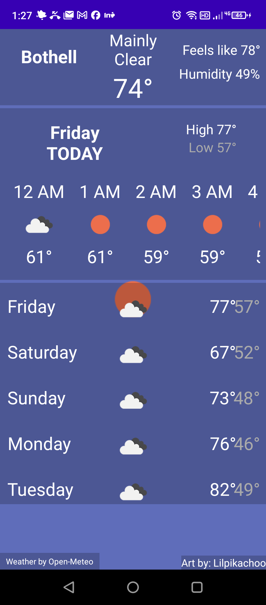
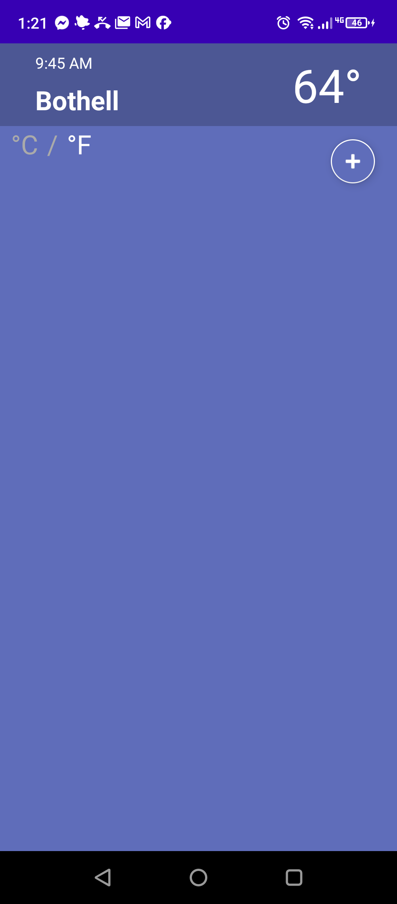

# Weatha

An Android weather app built in Java that displays current weather conditions and forecasts for your current location.

*Live weather on an Android phone — the device's location (Bothell), current conditions ("Partly Cloudy 64°"), and a matching icon. Weather now comes from the free, keyless Open-Meteo API.*

### More screens

| Forecast detail | Locations & units |
|---|---|
|  |  |
| Feels-like and humidity, an hourly strip, and a 5-day daily forecast with highs/lows. | Saved locations with the current temp, a °C / °F toggle, and an add-location button. |

## Features
- Current temperature, feels-like, humidity, and conditions
- Hourly strip and a 5-day daily forecast with highs/lows
- Location-based weather lookup for your current location
- °C / °F toggle and saved locations
- Clean and intuitive UI

## Weather data
Weather comes from the **[Open-Meteo](https://open-meteo.com) API**, which is free and
requires **no API key**. (The app originally used OpenWeatherMap's One Call 2.5 endpoint,
which was shut down; it has since been migrated to Open-Meteo.)

## Tech Stack
- **Language**: Java
- **Platform**: Android
- **Weather API**: Open-Meteo (free, keyless)
- **Build**: Gradle / Android Studio

## Getting Started
1. Clone the repo and open it in Android Studio
2. Run on a device or emulator — no API key or extra setup needed
3. Grant location access so the app can show weather for where you are
