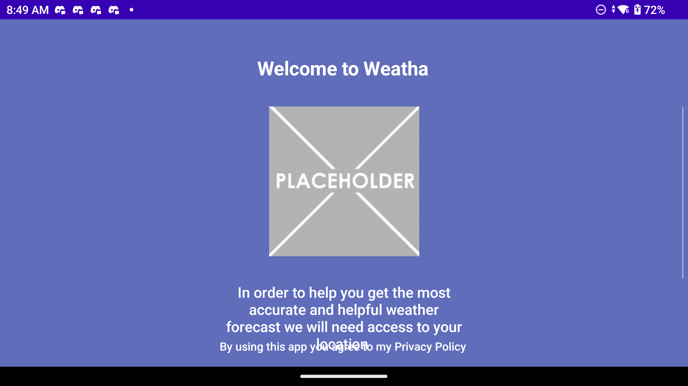

# Weatha

An Android weather app built in Java that displays current weather conditions and forecasts using the OpenWeatherMap API.

*The welcome / location-permission screen on an Android device. Live forecasts require granting location access and an OpenWeatherMap API key.*

## Features
- Current temperature, humidity, and conditions
- Location-based weather lookup
- Clean and intuitive UI

## Tech Stack
- **Language**: Java
- **Platform**: Android
- **API**: OpenWeatherMap
- **Build**: Gradle / Android Studio

## Getting Started
1. Get a free API key from [openweathermap.org](https://openweathermap.org/api)
2. Add your key to the project config
3. Open in Android Studio and run on a device or emulator
